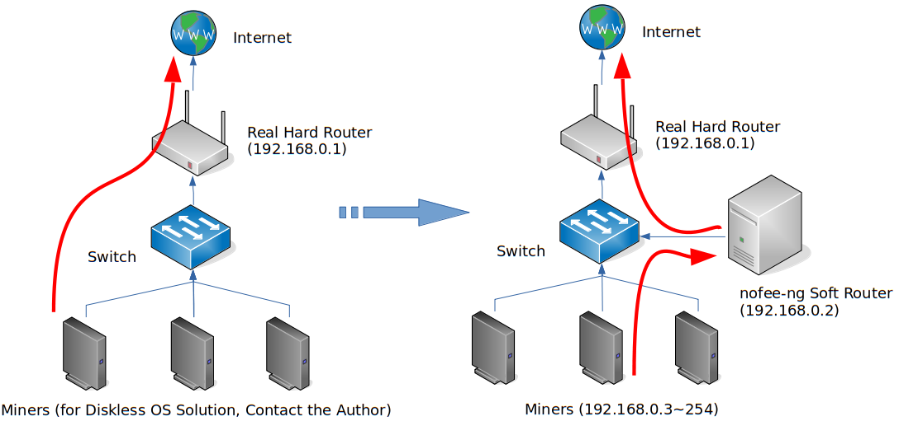

nofee-ng: Next Generation NoDevFee Mining Software for Cryptocurrency
===

### The first edition you can find on this planet that has the feature of anti-DevFee in a central mode for both GPU miners and hardware miners (FPGA, ASIC, etc). ###

`nofee-ng` is a generic solution for NoDevFee mining. It can get stolen cryptocurrency refunded back from mining software (which is known as DevFee and is about 0.5~2% of your total mining shares) for many kinds, such as ETH, ETC, XMR, ZCash, etc, by refunding DevFee to **ANOTHER wallet address** which can be different from the main mining address.

This is the **Next Generation** of NoDevFee program. It works as a *"soft router"* rather than the first generation which works on a single same machine together with the mining software. So, `nofee-ng` works for Windows， Linux and hardware miner although itself must be run in Linux.

`nofee-ng` is perfect for mining farms for easy management. If you're a mining farm operator, you can also redirect the DevFee to your own wallet without the knowledge of your tenants! Remember: you are **NOT** stealing from your clients because DevFee belonged to the mining software author.

### The refunded DevFee will show up in a mining pool in about 1~2 hours. Please be patient! ###

The refunded pool may be a different mining pool than your main pool since mining software may use another pool for DevFee. Please check the README.md in different implementation folders.

The mechanism of `nofee-ng` is depicted in the following paradigm: The original network traffic, e.g. mining work submission, goes from miners directly to the pool. But now the traffic is redirected to the `nofee-ng` *soft router* who will change the DevFee wallet to your own wallet address.

## Usage ##

1. Set up a Linux machine which runs `nofee-ng` as a *soft router*. Install iptables and iproute (on some distros it's called iproute2). `nofee-ng` is tested on Debian 9 (Stretch) and CentOS 8, but should work on other Linux distros. The gateway of this *soft router* should point to the *real hard router*, say 192.168.0.1 in the previous diagram.
2. Download the `nofee-ng` bundle from the corresponding folder for your cryptocurrency and extract it to `/opt/nofee-ng`.
3. Change the wallet address to your refunded DevFee address in `nofee.txt`.
4. Login as root or use sudo to execute the following commands on the Linux *soft router*:
 + `systemctl stop firewalld` (Skip this if you are not running a firewall)
 + `systemctl disable firewalld` (Skip this if you are not running a firewall)
 + Disable SELinux: Change the line containing `SELINUX=` in file `/etc/selinux/config` to `SELINUX=disabled`. And reboot the `nofee-ng` soft router (Skip this if you are not using SELinux)
 + `ln -s /opt/nofee-ng/nofee.service /etc/systemd/system/`
 + `systemctl enable nofee`
 + `systemctl start nofee`
5. Now use `systemctl status nofee` to check whether you can see something like `Active: active (running)` in the heading lines, `Found NoFee Wallet` and `Running` in the tailing lines. If so, congratulations, `nofee-ng` is configured properly and running. It will be auto started by systemd on next reboot. Otherwise check the error message and Google it or leave me a message.
6. Change the default gateway for all your miners to let them point to the *nofee-ng soft router*, say 192.168.0.2 in the next paradigm. You can do this on the DHCP server, e.g. the *real hard router*. Don't be afraid that traffic other than stratum will not work, `nofee-ng` won't touch them.
7. Now let your miners work as usual. After about 1~2 hours, the refunded DevFee will show up in the mining pool as a new miner. The pool and miner's name depend on the mining software. For example, it may be *eth1.0* for ETH. Please check the implementation folder for detail.

## Standalone Mode ##

Besides *soft router* mode, `nofee-ng` can also run in *standalone mode*. In this mode, you don't need to set up a soft router, `nofee-ng` runs on the same machine with the mining software. So it doesn't work for Windows miners. If you are a miner vendor, you can **integrate** `nofee-ng` with your product.

1. Deploy `nofee-ng` on the same machine with you Linux miner.
2. Follow the instructions in the "Usage" section to stop firewall and disable SELinux.
3. Change the `ExecStart=` in `nofee.service` to `/opt/nofee-ng/nofee_eth -rs`. The `-rs` argument means `nofee-ng` is running in standalone mode.
4. Starts `nofee-ng`:
 + `ln -s /opt/nofee-ng/nofee.service /etc/systemd/system/`
 + `systemctl enable nofee`
 + `systemctl start nofee`

## Caution ##

1. **DO NOT** forget to change the wallet address in `nofee.txt`
2. Use **PLAIN** mining protocols. **DO NOT** use encrypted mining protocols like SSL stratum. But **sometimes** despite you use plain mining protocols on your main wallet, the mining software will still use SSL protocols for DevFee which makes `nofee-ng` unable to detect DevFee. This is found when using PhoenixMiner.
3. If DevFee is found, a line `DevFee found` will show up in `systemctl status nofee`. But **NOT ALL** DevFee found will become valid shares on the pool.
4. **DO NOT** kill nofee process with `kill -9`. If you want to stop it, use `systemctl stop nofee`

## Looking for test first? ##

There are two ways to test whether `nofee-ng` works for your miner softwares. If it doesn't work, leave me an issue and I'll add support to your miner as soon as possible.

1. Just change the gateway address of one miner to the `nofee-ng` soft router instead all of them and check the result. This is the recommended way.
2. Use *standalone mode* on one miner to test it .
3. When available, use more than one miners to test so that you can get your DevFee refunded more quickly.

*A little advertisement*: We have a pratical diskless OS mining solution which can reduce the maintenance and cost both for mining farms and miner owners. Any time you have requirements or interest to build such a diskless OS, leave me an issue on Github.

---

---

nofee-ng：下一代反抽水挖矿软件
===

### 市面上所能找到的第一款基于中心模式的反抽水挖矿软件，可同时用于GPU矿机及专用硬件矿机（如FPGA、ASIC矿机） ###

`nofee-ng`是一个通用的反抽水挖矿的解决方案。挖矿软件在工作的时候通常会偷算力（DevFee，大概占总算力的0.5~2%），`nofee-ng`可以把这部分被偷取的算力返还给你，它支持多种加密货币，如ETH、ETC、XMR、ZCash等。被偷取的算力可以被返还到主挖矿钱包，也可以返还到**另外一个钱包**。

本项目是**下一代**反抽水软件。它与上一代反抽水软件（必须与挖矿软件运行在同一台矿机上）不同的是，它是以*“软路由”*的形式进行工作的。因此，尽管`nofee-ng`本身必须运行在Linux环境下，但它可同时适用于Windows、Linux以及专用矿机。

因其易于管理，对于矿场来说，`nofee-ng`是理想的选择。如果你是矿场的运营者，你甚至可以在你的客户不知情的情况下把被偷的算力返还到你自己的钱包中。记住：你并**没有**偷取你客户的算力（DevFee），因为它们本来就是会被挖矿软件偷取的。

### 返还的算力将会在1~2小时内出现在矿场中，请耐心等待 ###

部分挖矿软件会使用不同于你挖矿的主矿池进行偷算力，因此返还的矿池可能会不同于主矿池，详情请查看各个不同加密货币文件夹下的说明。

`nofee-ng`的原理如图所示：原来的网络流量（如挖矿结果提交）直接由矿机提交到矿池。但现在的网络流量被重定向到`nofee-ng`所在的*软路由*服务器上，它将把DevFee的钱包改为你自己的钱包。

## 用法 ##

1. 准备一台安装了Linux操作系统的服务器，它将用于运行`nofee-ng`作为*软路由*。安装iptables及iproute（部分发行版叫iproute2）。`nofee-ng`在Debian 9 (Stretch)及CentOS 8上进行过测试，但应该适用于其它Linux发行版。修改Linux*软路由*的网关地址，让它指定*真实的物理路由器*地址（例如前面图中的192.168.0.1）。
2. 下载对应数字货币目录下的打包文件，并将它解压到`/opt/nofee-ng`。
3. 把`nofee.txt`中的地址改成你要返还的钱包地址。
4. 在Linux*软路由*上用root登录或通过sudo执行如下命令：
 + `systemctl stop firewalld` (如果你没有开启防火墙请跳过此步)
 + `systemctl disable firewalld` (如果你没有开启防火墙请跳过此步)
 + 关闭SELinux: 把文件`/etc/selinux/config`中含有`SELINUX=`的一行改成`SELINUX=disabled`，并重启`nofee-ng`软路由 (如果你没有开启SELinux请跳过此步)
 + `ln -s /opt/nofee-ng/nofee.service /etc/systemd/system/`
 + `systemctl enable nofee`
 + `systemctl start nofee`
5. 使用`systemctl status nofee`检查输出的前面几行是否出现`Active: active (running)`，并且后面几行是否出现`Found NoFee Wallet`及`Running`，如果是的话，那么恭喜你，`nofee-ng`已经正确配置并且正在运行，在系统下次重启的时候它将由systemd自动启动。如果没有出现上述字样，请检查一下错误信息，Google一下或给我留言。
6. 更改所有矿机的网关地址，并让它们指向*nofee-ng软路由*，也就是前面图中的192.168.0.2。你也可以直接在DHCP服务器上（例如物理路由器）修改，直接把网关地址指向此软路由。无需担忧非挖矿协议不能工作，因为`nofee-ng`并不会修改它所不认识的流量。
7. 让你的矿机如常运行，大概1～2小时后，返还的算力（DevFee）将以一个新的矿工名出现在矿池中。返还的矿池及矿工名因挖矿软件而异，例如对ETH而言，新矿工名将是*eth1.0*，具体请参考相应的加密货币文件夹下的说明。

## 独立模式 ##

除了*软路由*模式外，`nofee-ng`还可以运行在*独立*模式下。在此模式下，你不需要单独一台服务器来配置*软路由*，`nofee-ng`将与挖矿软件运行在同一台机器上，因此独立模式并不适用于Windows矿机。如果你是矿机销售商，可以用此模式把`nofee-ng`和你的矿机一起**捆绑销售**。

1. 把`nofee-ng`和你的Linux矿机部署在同一台机器上。
2. 参考“用法”部分的指引关闭防火墙和SELinux。
3. 把`nofee.service`中的`ExecStart=`行改为`/opt/nofee-ng/nofee_eth -rs`。`-rs`参数将让`nofee-ng`运行于独立模式。
4. 启动`nofee-ng`：
 + `ln -s /opt/nofee-ng/nofee.service /etc/systemd/system/`
 + `systemctl enable nofee`
 + `systemctl start nofee`

## 注意点 ##

1. **不要忘记**更改`nofee.txt`下面的返回钱包地址。
2. 使用**明文**的挖矿协议，**不要**使用加密的挖矿协议，例如SSL。但有些时候尽管你在主挖矿钱包上使用了明文挖矿协议，挖矿软件**偶尔**还是会使用SSL协议来挖DevFee，从而造成`nofee-ng`检测不到DevFee。PhoenixMiner就是如此。
3. 如果检测到DevFee，`systemctl status nofee`将会出现一行`DevFee found`。但并**不是所有**的DevFee都会成为矿池中的有效份额。
4. **不要**使用`kill -9`来杀进程，如果你想关掉它，请使用`systemctl stop nofee`。

## 想要先测试一下？ ##

有两种方式可以测试一下`nofee-ng`能否适配你的挖矿软件。如果不能，请给我留个议题（Issue），我将尽快修复问题。

1. 推荐方式：只修改其中一台矿机的网关地址，让其指向*软路由*，并检查返回钱包中是否有新矿机。
2. 使用*独立模式*在一台矿机上测试。
3. 尽量多开几台矿机来测试，这样你能更快地在矿池中看到DevFee返还。

*插播一段小广告*：我们有一套可行的无盘挖矿解决方案，对矿场而言可降低维护成本，对矿主而言可降低硬件预算。如果你有无盘挖矿的需求或兴趣，请在Github上给我留一个Issue。
